# Network Diagnostics & Monitoring Suite

[](https://www.python.org/)
[](#testing)
[](#cross-platform-verification)
[](#license)

A professional cross-platform Python toolkit for network diagnostics, connectivity testing, service reachability analysis, traffic monitoring, and structured diagnostic reporting.

The application provides a unified command-line interface for investigating common network problems without relying on external cloud infrastructure. It combines Python networking APIs, operating-system diagnostic commands, traffic statistics, automated testing, and privacy-aware reporting in a modular application architecture.

---

## Engineering Evidence

This project demonstrates practical engineering work across network troubleshooting, Python automation, Linux and Windows operations, CLI development, testing, and diagnostic reporting.

**Current verified evidence includes:**

* **41 automated tests passing** on Linux with Python 3.14.4
* Complete test-suite verification on Windows 11 with Python 3.14.7
* Cross-platform implementation for Windows, Linux, and macOS
* Network interface, connectivity, DNS, TCP, routing, and traffic diagnostics
* Structured JSON diagnostic report generation
* Privacy-aware masking of network information for safer sharing
* CLI screenshots and test evidence
* Demonstration videos for diagnostic reporting and continuous traffic monitoring
* Modular application architecture with dedicated collectors, services, CLI functionality, and tests

The project is designed as an operational troubleshooting utility that can help investigate common network and connectivity issues in development, support, and infrastructure-oriented environments.

---

## Overview

**Network Diagnostics & Monitoring Suite** is a practical network troubleshooting utility for investigating connectivity, DNS, TCP service, routing, and traffic-related issues.

The toolkit provides a single command-line interface for performing common network diagnostic operations and consolidating results into structured reports.

It can:

* Inspect local network interfaces
* Test network reachability and latency
* Resolve DNS hostnames
* Test TCP service availability
* Trace network paths
* Monitor network traffic
* Measure traffic rates over configurable intervals
* Generate consolidated JSON diagnostic reports
* Handle common network and command-execution failures
* Mask sensitive network information for safer sharing
* Validate core functionality through automated tests

The project follows a modular architecture that separates diagnostic collectors, reporting services, CLI functionality, and automated tests.

---

## Key Capabilities

### Network Interface Diagnostics

Discovers local network interfaces and reports:

* Interface status
* Link speed
* MTU
* Network addresses
* Traffic counters
* Packet statistics

### Connectivity Diagnostics

Tests destination reachability using platform-aware ICMP ping commands and reports:

* Successful attempts
* Failed attempts
* Packet loss
* Minimum latency
* Maximum latency
* Average latency
* Diagnostic execution time

### DNS Diagnostics

Resolves hostnames and reports:

* IPv4 addresses
* IPv6 addresses
* Lookup duration
* Resolution failures

### TCP Port Diagnostics

Tests TCP service reachability and provides:

* Destination resolution
* TCP port status
* Connection latency
* Connection failure classification
* DNS resolution error handling
* Timeout handling
* Network and host unreachable handling

### Route Diagnostics

Inspects the network path to a destination using platform-aware route tracing.

The implementation supports:

* `traceroute` where available
* `tracepath` as a Linux fallback
* `tracert` on Windows
* Hop numbers
* Responding addresses
* Timeout hops
* Route completion status
* Diagnostic duration
* Configurable maximum hop limits

This allows route diagnostics to remain functional across different operating-system environments without requiring one specific command to be installed everywhere.

### Network Traffic Monitoring

Collects per-interface network statistics including:

* Bytes sent
* Bytes received
* Packets sent
* Packets received
* Input/output errors
* Input/output drops

The toolkit also supports continuous traffic monitoring with configurable measurement intervals.

### Diagnostic Reporting

The reporting service combines multiple diagnostic sources into a structured JSON report containing:

* Network environment summary
* Interface information
* Connectivity results
* DNS results
* TCP port results
* Route diagnostics
* Traffic counters
* Traffic-rate measurements
* Report metadata
* Privacy information

Reports use timestamped filenames for easier identification and archival.

---

## Privacy & Safe Sharing

Network diagnostic output can contain information that should not be publicly exposed.

The application therefore includes privacy-aware output handling that masks network information before it is displayed through supported CLI views or included in sanitized diagnostic reports.

For example:

```text
192.168.1.25
```

is displayed as:

```text
192.168.x.x
```

MAC addresses and IPv6 addresses are also partially masked.

Diagnostic reports include a privacy notice indicating that network addresses have been masked for safer sharing.

> Privacy masking is intended to reduce accidental exposure when sharing diagnostic evidence. It should not be treated as a complete security or anonymization mechanism.

---

## Project Demonstration

The project includes visual evidence captured during development, automated testing, and real-world Linux network diagnostics.

### Complete Network Diagnostic Report

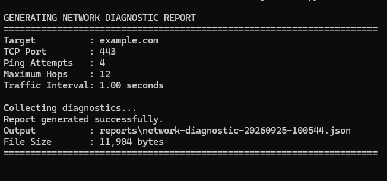

### Network Environment Summary

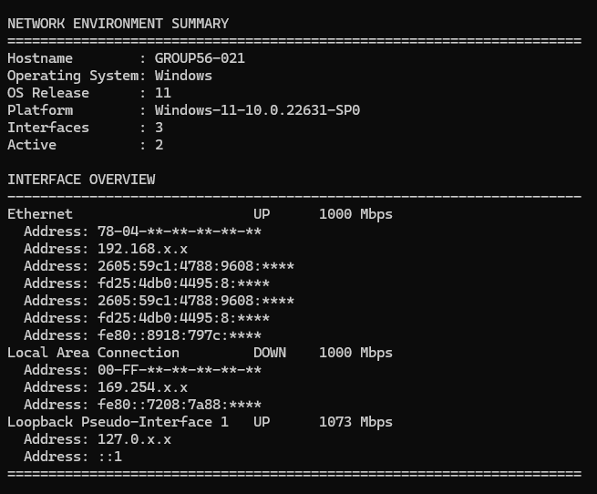

### Network Interface Discovery

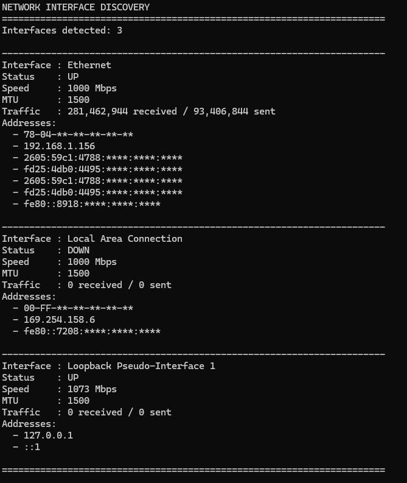

### Connectivity Diagnostics

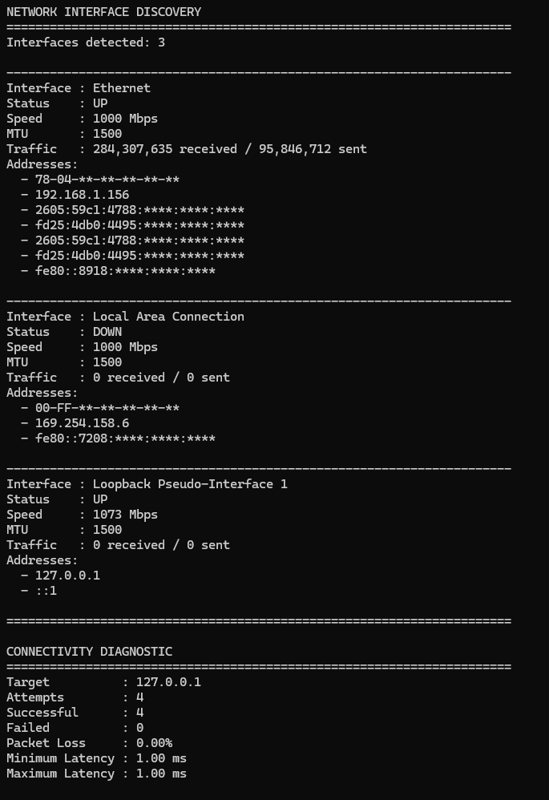

### DNS Resolution

**Successful resolution:**

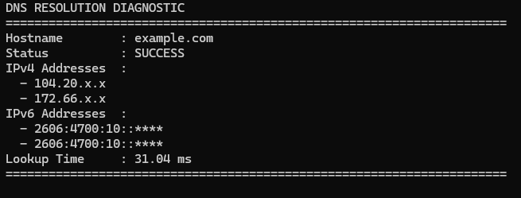

**Failed resolution:**

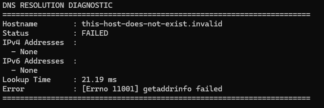

### TCP Port Diagnostics

**Reachable service:**

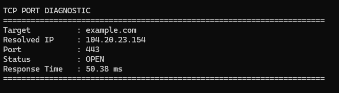

**Unreachable service:**

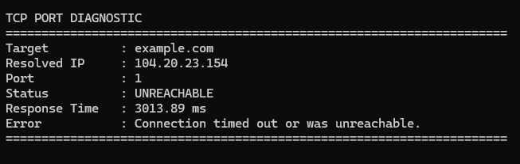

### Route Diagnostics

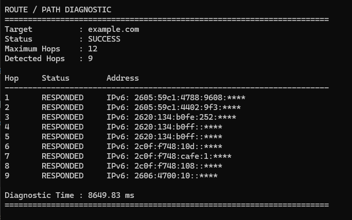

### Network Traffic Monitoring

**Single traffic measurement:**

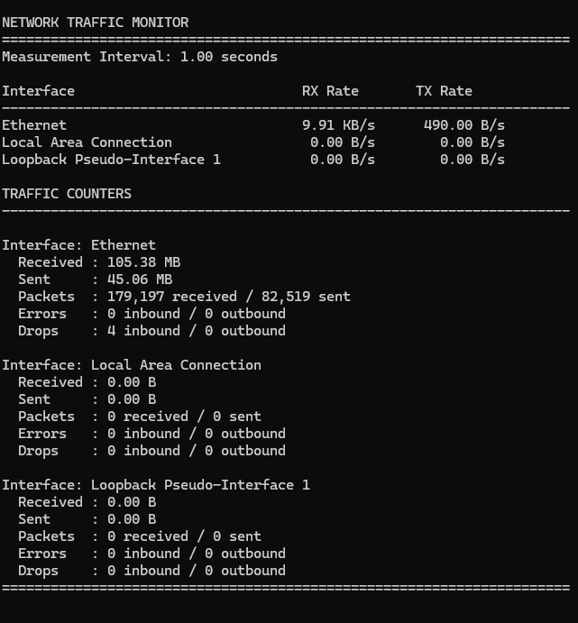

**Continuous traffic monitoring:**

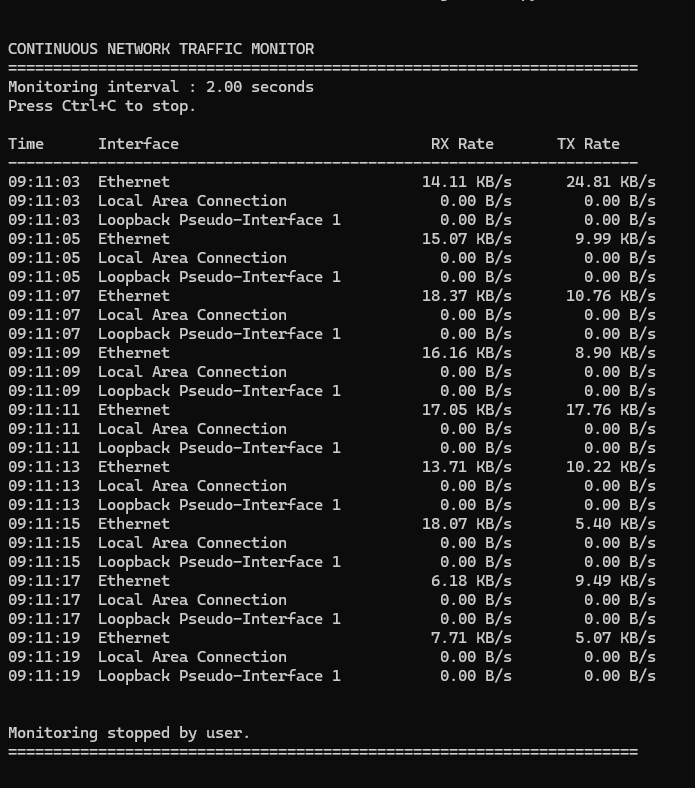

### Additional Linux Validation Evidence

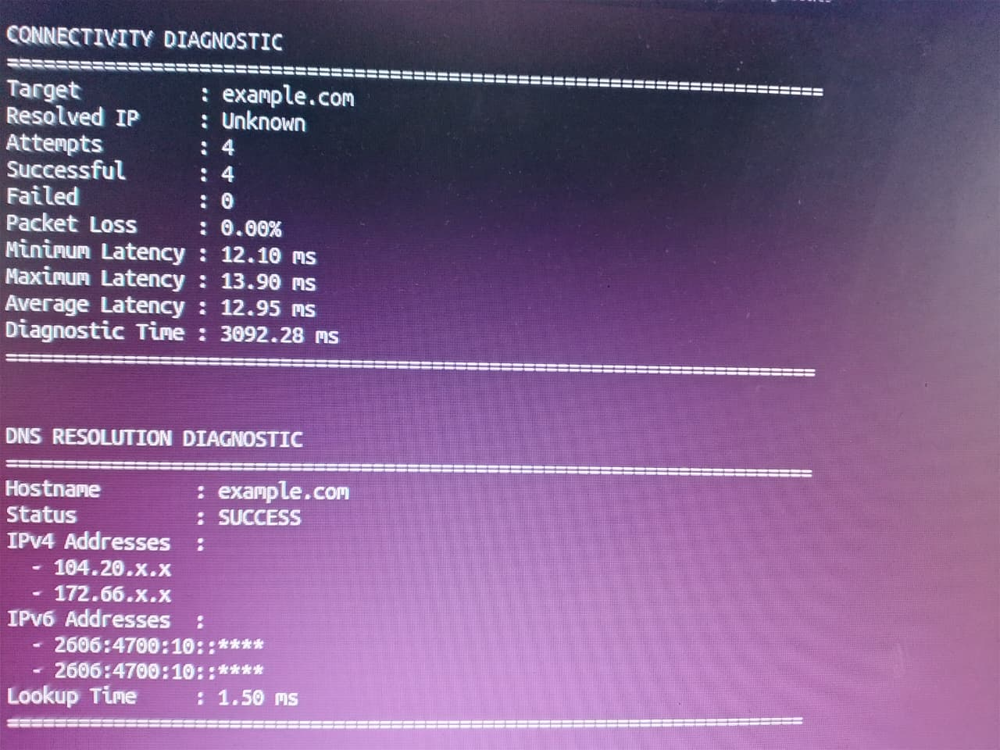

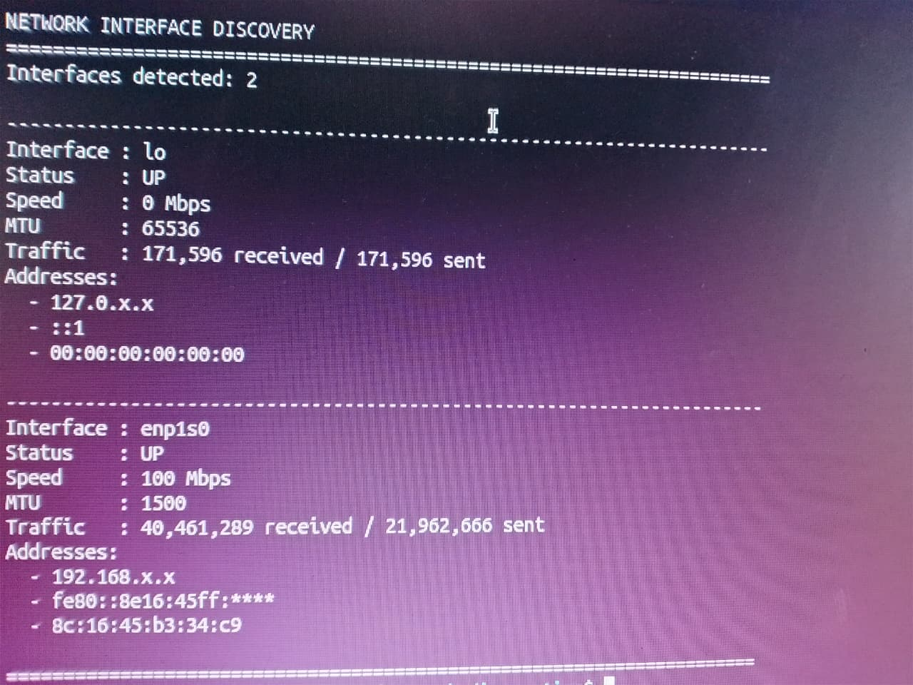

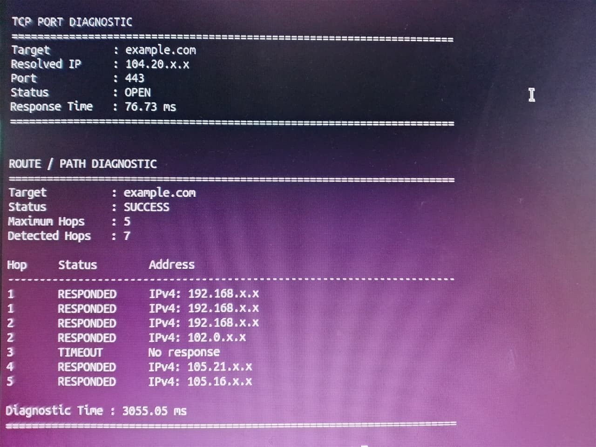

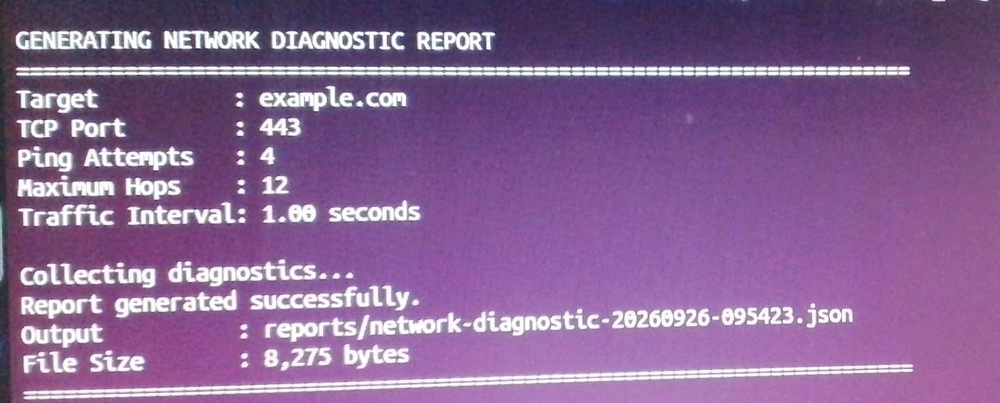

### Automated Testing

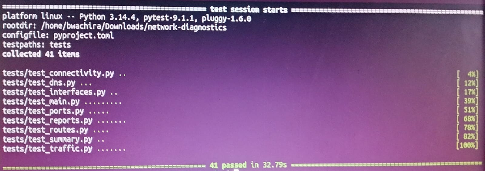

**CLI tests:**

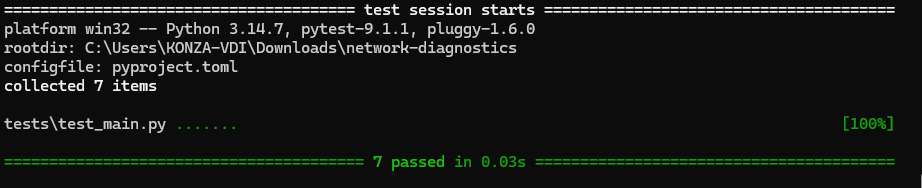

**Network interface tests:**

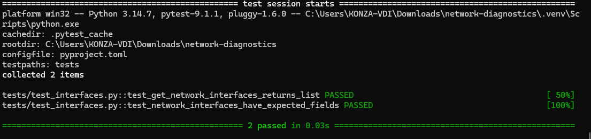

---

## Video Demonstrations

### Complete Diagnostic Report

[▶ View the Network Diagnostic Report demonstration](docs/videos/network-diagnostic-report.mp4)

Demonstrates the complete diagnostic reporting workflow and generated results.

### Continuous Traffic Monitoring

[▶ View the Network Traffic Monitoring demonstration](docs/videos/network-traffic-watch.mp4)

Demonstrates real-time traffic-rate monitoring across network interfaces.

---

## CLI Usage

The application provides a command-oriented interface for common network troubleshooting operations.

### Display Network Interfaces

```bash
python -m network_diagnostics.main interfaces
```

Displays detected interfaces, operational status, link speed, MTU, addresses, and traffic counters.

### Test Connectivity

```bash
python -m network_diagnostics.main ping example.com
```

Tests reachability and reports packet loss and latency measurements.

### Resolve DNS

```bash
python -m network_diagnostics.main dns example.com
```

Performs hostname resolution and reports IPv4/IPv6 results and lookup timing.

### Test a TCP Port

```bash
python -m network_diagnostics.main port example.com 443
```

Tests TCP connectivity to the specified service port.

### Trace a Network Route

```bash
python -m network_diagnostics.main route example.com
```

Inspects the network path toward the destination.

A maximum hop count can also be specified:

```bash
python -m network_diagnostics.main route example.com --max-hops 5
```

### Display Network Summary

```bash
python -m network_diagnostics.main summary
```

Displays a high-level summary of the local network environment.

### Monitor Network Traffic

```bash
python -m network_diagnostics.main traffic
```

Displays current network traffic counters.

For continuous monitoring:

```bash
python -m network_diagnostics.main traffic --watch --interval 2
```

The interval can be adjusted according to the required monitoring frequency.

### Generate a Diagnostic Report

```bash
python -m network_diagnostics.main report example.com
```

Generates a consolidated timestamped JSON diagnostic report.

The report command supports configurable options for:

* TCP port
* Ping count
* Connection timeout
* Maximum route hops
* Traffic measurement interval
* Report output directory

Example:

```bash
python -m network_diagnostics.main report example.com --port 443 --count 4 --timeout 3 --max-hops 12 --interval 1
```

---

## Project Structure

```text
network-diagnostics/
├── docs/
│   ├── images/
│   └── videos/
├── reports/
├── src/
│   └── network_diagnostics/
│       ├── collectors/
│       │   ├── connectivity.py
│       │   ├── dns.py
│       │   ├── interfaces.py
│       │   ├── ports.py
│       │   ├── routes.py
│       │   ├── summary.py
│       │   └── traffic.py
│       ├── services/
│       │   ├── __init__.py
│       │   └── reports.py
│       ├── utils/
│       │   └── __init__.py
│       ├── config.py
│       ├── main.py
│       └── __init__.py
├── tests/
│   ├── __init__.py
│   ├── test_connectivity.py
│   ├── test_dns.py
│   ├── test_interfaces.py
│   ├── test_main.py
│   ├── test_ports.py
│   ├── test_reports.py
│   ├── test_routes.py
│   ├── test_summary.py
│   └── test_traffic.py
├── .gitignore
├── LICENSE
├── pyproject.toml
├── requirements.txt
└── README.md
```

Generated diagnostic reports are intentionally excluded from version control through `.gitignore`.

---

## Technology Stack

| Technology   | Purpose                                  |
| ------------ | ---------------------------------------- |
| Python 3.11+ | Application development                  |
| psutil       | Network interface and traffic statistics |
| socket       | DNS resolution and TCP networking        |
| subprocess   | Platform-specific network diagnostics    |
| argparse     | Command-line interface                   |
| JSON         | Structured diagnostic reports            |
| pytest       | Automated testing                        |
| Git          | Version control                          |
| GitHub       | Source control and project delivery      |

---

## Installation

### Windows

```cmd
git clone https://github.com/bwachira649/network-diagnostics.git
cd network-diagnostics
python -m venv .venv
.venv\Scripts\activate
python -m pip install --upgrade pip
python -m pip install -r requirements.txt
python -m pip install -e .
```

### Linux

```bash
git clone https://github.com/bwachira649/network-diagnostics.git
cd network-diagnostics
python3 -m venv .venv
source .venv/bin/activate
python -m pip install --upgrade pip
python -m pip install -r requirements.txt
python -m pip install -e .
```

### macOS

```bash
git clone https://github.com/bwachira649/network-diagnostics.git
cd network-diagnostics
python3 -m venv .venv
source .venv/bin/activate
python -m pip install --upgrade pip
python -m pip install -r requirements.txt
python -m pip install -e .
```

---

## Testing

Run the complete automated test suite:

```bash
python -m pytest
```

Current verified Linux result:

```text
41 passed in 16.83s
```

The test suite covers:

* Connectivity diagnostics
* DNS resolution
* Network interface discovery
* CLI parsing and arguments
* Privacy masking
* TCP port diagnostics
* Report generation
* Route diagnostics
* Network summaries
* Traffic measurement
* Continuous traffic monitoring
* Input validation
* Error handling
* Test isolation and mocking

The project has been validated on both Windows and Linux.

---

## Cross-Platform Verification

### Windows

Verified environment:

```text
Windows 11
Python 3.14.7
pytest 9.1.1
psutil 7.2.2
41 automated tests passing
```

The complete diagnostic workflow was executed successfully on Windows.

### Linux

Verified environment:

```text
Linux
Python 3.14.4
41 automated tests passing
```

The Linux implementation was validated using real network operations including:

* Network interface discovery
* ICMP connectivity testing
* DNS resolution
* TCP port testing
* Route diagnostics
* Network traffic monitoring
* Network environment summary
* JSON diagnostic report generation

Linux route diagnostics were additionally validated using `tracepath` because `traceroute` was not installed on the test environment.

### macOS

The application architecture uses Python standard-library networking functionality and platform-aware command handling.

macOS support is intended where the required system diagnostic commands are available.

---

## Practical Skills Demonstrated

This project demonstrates practical experience with:

* Python application architecture
* Modular package design
* Network programming
* Socket programming
* DNS diagnostics
* TCP connectivity testing
* ICMP-based connectivity testing
* Network route analysis
* Network interface monitoring
* Network traffic measurement
* Platform-aware command execution
* Cross-platform application design
* CLI application development
* Structured JSON reporting
* Input validation
* Error handling
* Privacy-aware diagnostic output
* Automated testing with pytest
* Test isolation and mocking
* Git version control
* Technical documentation
* Evidence-driven software demonstration

---

## Development Workflow

The project was developed using an evidence-driven workflow:

```text
Build
  ↓
Test
  ↓
Capture Evidence
  ↓
Document
  ↓
Demonstrate
  ↓
Cross-Platform Verify
  ↓
Publish
```

This workflow ensures that the project includes both functional implementation and visible evidence of testing and practical operation.

---

## Project Status

### Core Development

**Complete**

The Network Diagnostics & Monitoring Suite has been implemented as a modular Python application with:

* Network interface diagnostics
* Connectivity testing
* DNS diagnostics
* TCP port testing
* Route tracing
* Traffic monitoring
* Diagnostic reporting
* Privacy-aware output
* Automated testing

### Automated Testing

**Complete**

```text
41 passed
```

### Windows Verification

**Complete**

The application and complete test suite have been validated on Windows 11.

### Linux Verification

**Complete**

The application and complete test suite have been validated on Linux, including real network diagnostic operations and JSON report generation.

### Visual Evidence

**Complete**

The repository contains screenshots covering network diagnostics, testing, traffic monitoring, route analysis, DNS resolution, TCP connectivity, and report generation.

### Video Demonstrations

**Complete**

Demonstration videos are included for diagnostic reporting and continuous network traffic monitoring.

### GitHub Publication

**Published**

The project is available on GitHub with source code, documentation, automated tests, screenshots, demonstration videos, and an MIT license.

---

## License

This project is released under the MIT License.

See the [LICENSE](LICENSE) file for the full license text.
